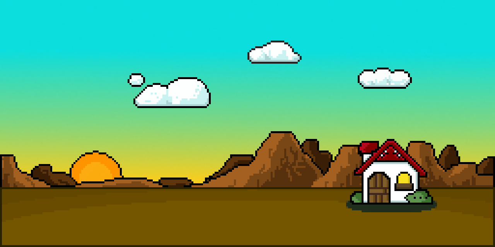
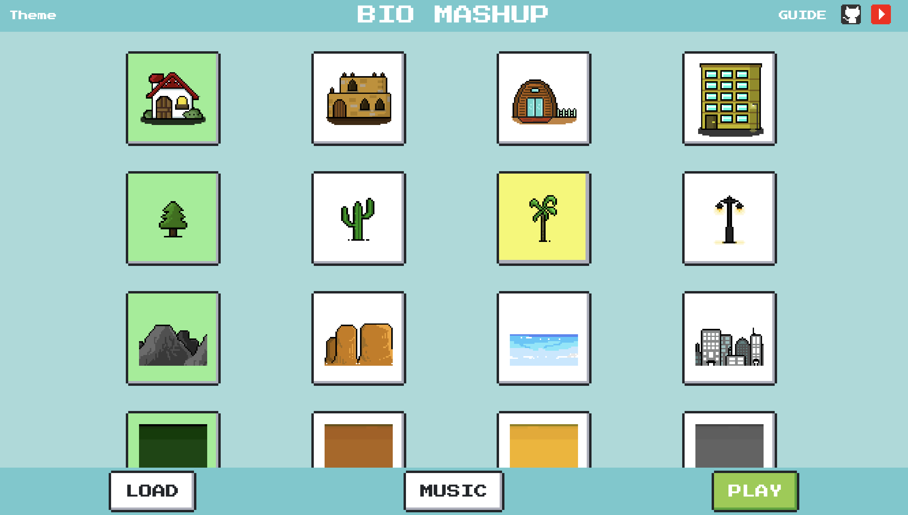
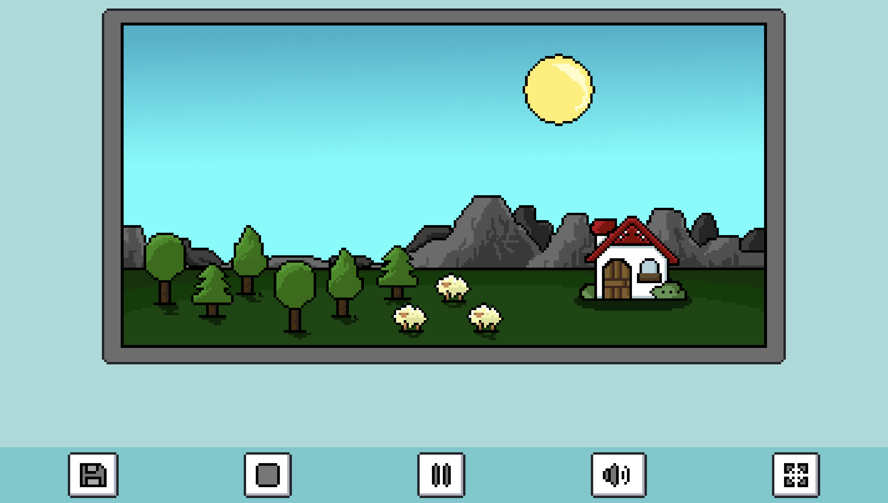
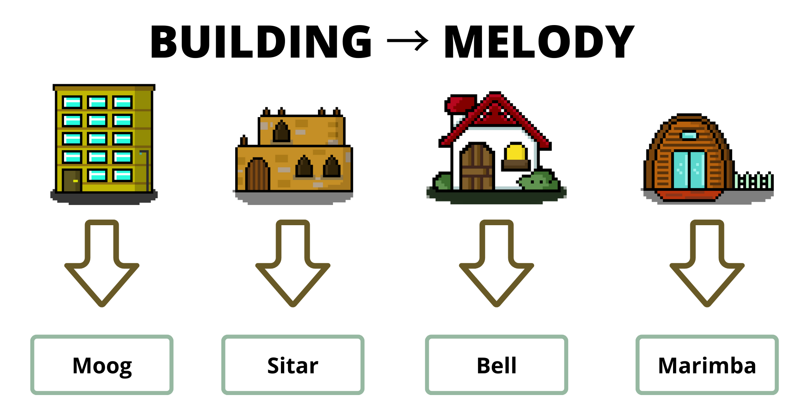
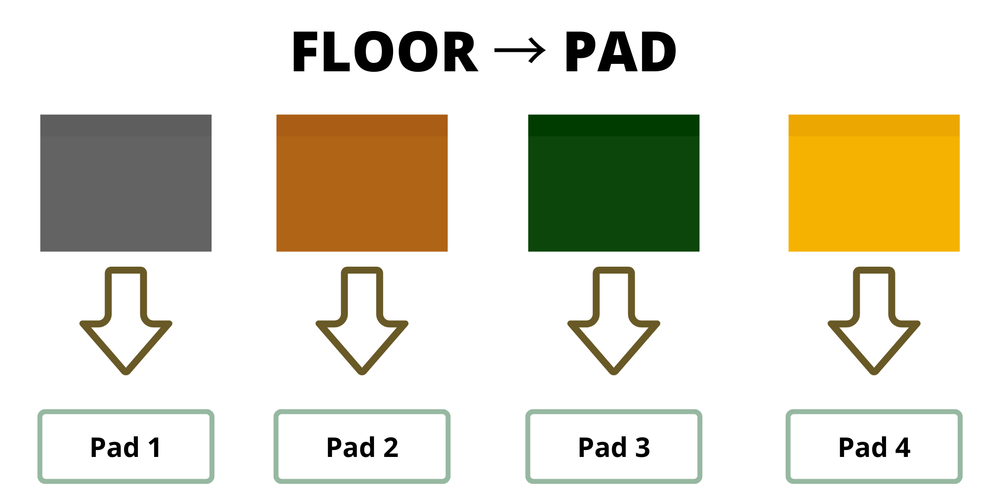
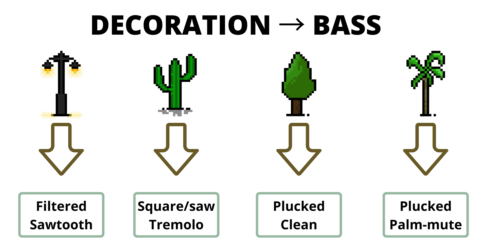
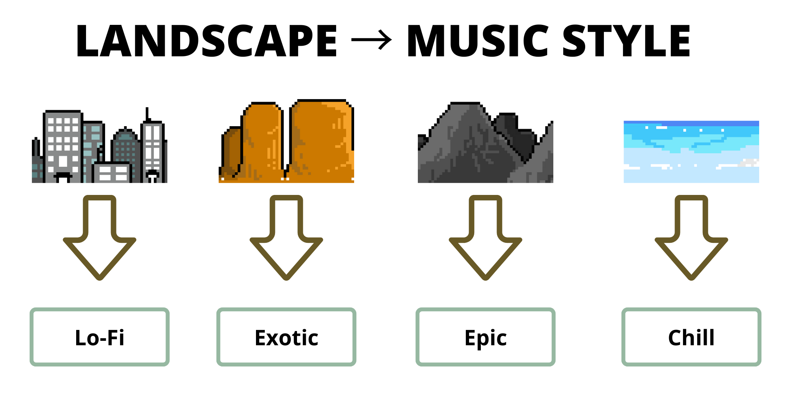
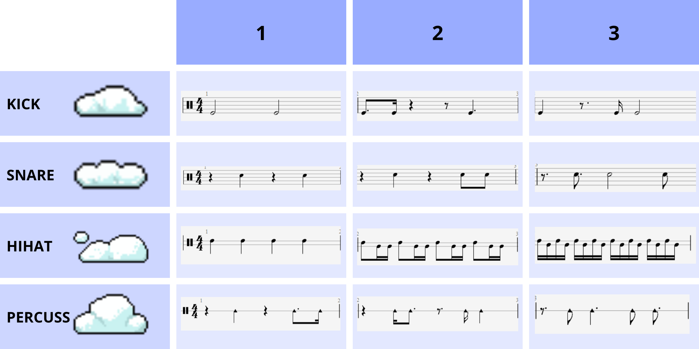
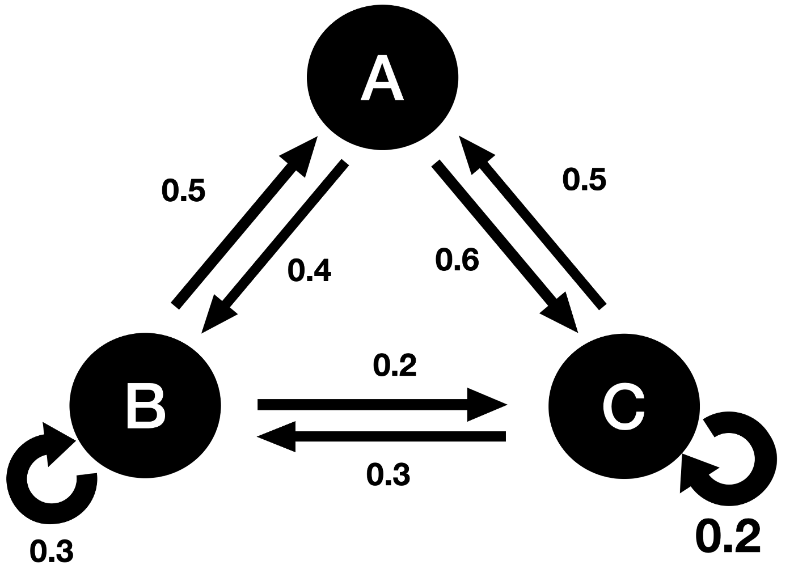

# **BIO MASHUP**

- [**BIO MASHUP**](#bio-mashup)
  - [INTRODUCTION](#introduction)
  - [User Guide](#user-guide)
    - [Menu](#menu)
    - [NOTES](#notes)
    - [Caption: elements and music](#caption-elements-and-music)
      - [Melody Instrument](#melody-instrument)
      - [Chords Instrument](#chords-instrument)
      - [Bass](#bass)
      - [Music Style](#music-style)
      - [Rhythmic Pattern](#rhythmic-pattern)
  - [Music generation](#music-generation)
    - [Markov Chain](#markov-chain)
    - [Leadsheet Notation](#leadsheet-notation)
    - [Styles](#styles)
  - [Implementation](#implementation)
  - [Results and final considerations](#results-and-final-considerations)
  - [Group members](#group-members)

## INTRODUCTION
  Project developed for the course "Advance Coding Tools and Methodologies", held in the Master degree of Music and Acoustic Engineering, based in "Politecnico di Milano". 
  The project aims at the production of generative music threw the combination of different melodic and rythmic music styles, different instruments. Every component is represented by a simple and friendly visual component, combining the various component the user can build a visual and musical environment.

## User Guide

The system can be tested by the user in two ways: 
- [Hosted website](https://pox17.github.io/ACTAMProject/)
- Downloading the whole project from GitHub and running it using VS CODE live server
  

### Menu 

Through the main menu the user can choose one of the many combinations of environment components, in order to build the desired environment. 

Once the user found the wanted combination the user can let the system generate the musical part to be played pressing the "MUSIC" button: 
When a music part is not ready the button is white. 

  
   

When the music part is ready the same button becomes blue.

Once the music is ready the user can click on the "PLAY" button and start the music playing. 

   

The bar positioned below the main visualizer allows the user to control the system while the playback is active: 
- SAVE BUTTON: The button allows the user to safe the environment generated on the database.
- STOP BUTTON: The stop button allows the user to stop the environment playback and to go back to the menu page. 
- PLAY/PAUSE BUTTON: The play/pause button allows the user to pause and restart the playback of the system. 
- VOLUME BUTTON: The volume button allows to silence and to restore the audio value of the system. If hovered a volume slider is visualized and allows the user to set the desired volume 
- FULLSCREEN BUTTON: Clicking on the fullscreen button the main environment playback is expanded to fullscreen. Push the "ESC" button on the keyboard to get back to standard visualization.
### NOTES 
- Use on Mozilla Firefox for best user experience
- Internet connection needed while using the website in order to correctly downloading all the components.

### Caption: elements and music

#### Melody Instrument
The instruments used to play the melodic part is represented by the building elements in the canva. Selecting a building to populate your environment the system uses different instruments to play the melody part, dictated by the landscape. The instruments have been chosen in a way that characterize the their native environment.

  

#### Chords Instrument
The instruments used to play the harmonic part is represented by the floor elements in the canva. All pads are synthsized and mostly obtained by subtractive synthesis in Reaper DAW. Each one presents different characteristics in term on harmonic content, envelope and modulation effects. 

  

#### Bass
The instruments used to play the bass part is represented by the decorative elements in the canva. All basses are synthsized and mostly obtained by subtractive synthesis in Reaper DAW. 
Choosing different decorative element a different bass is used, which will play the root note and the fifth of the harmony chord.

  

#### Music Style
Music style is dictated by the choose of the landscape element in the canva.
All music parts of melody, harmony and bass obey to the nodes of the Markov chain generated for each landscape choice.

  

#### Rhythmic Pattern
Rhythmic patterns are represented by the number of clouds. Each cloud represents a different instrument like kick drum, snare drum, shakers and wood percussions. No clouds means no rhythmic pattern, therefore no rhythmic sound at all. Choosing one or more cloud for each type the pattern of that instrument get more complex, according to the table below. Try different combinations to create your rhythm!

  

<!--  -->

## Music generation 

### Markov Chain
A Markov Chain (or Markov process) is a stochastic model describing a sequence of possible events in which the probability of each event depends only on the state attained in the previous event. Each event is represented by a **node** of the chain that is connected with itself and/or other nodes by **probability arcs**. So when the Markov Process begins it can last forever, thus giving birth to infinite generative music.

  

### Leadsheet Notation
### Styles
A brief overview of musical styles follows.

Mountain:

- predominant use of harmonic notes for melody 
- use of both rhythmic and lyric styles 
- large use of VI-V-I turnaround, with some modulations

City:

- use of syncopations and rhythmic lags
- melodic phrases similar to lo-fi music
- use of phrygian mode, with recurrent minor harmonies 

Desert:

- use of harmonic, phrygian, dominant phrygian and double harmonic scales
- large use of fourth turnarounds

Seaside:

- lot of emphasis on current harmony notes
- use of long notes counterpoised to short secondary notes 
- large use of minor harmony, use of weak cadences 

## Implementation
 Given the unusual nature of the system built, it is implemented using mostly raw HTML, CSS and JAVASCRIPT code, some frameworks and instruments have been used for the development in order to speed up and enhance the results obtained by the system: 

- [Tone.js](https://tonejs.github.io/)
- [Firebase](https://firebase.google.com/)
- [NES CSS](https://nostalgic-css.github.io/NES.css/)
- [Shepherd.js](https://shepherdjs.dev/)

<<<<<<< HEAD

### Audio Generation
All the audio generation and synchronizing is implemented using Tone.js.

=======
All the audio is played and synchronized through the development tools provided by Tone.js.
All the data used to populate the system are stored in an instance of firestore database provided by the firebase application. 
>>>>>>> 9c8fe46b0388e84d8820f9f84846fc02fe0fa7af

## Results and final considerations

## Group members
- Paolo Ostan (paolo.ostan@mail.polimi.it)
- Stefano Donà (stefano2.dona@mail.polimi.it) 
- Sofia Parrinelli (sofia.parrinelli@mail.polimi.it)

