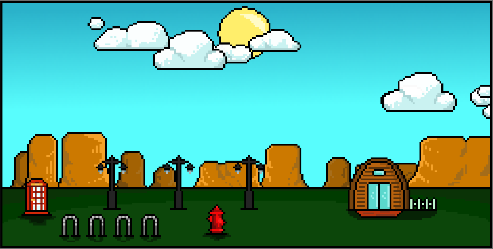

# **BIO MASHUP**

<!--  -->

  

- [**BIO MASHUP**](#bio-mashup)
  - [INTRODUCTION](#introduction)
  - [User Guide](#user-guide)
    - [Menu](#menu)
    - [NOTES](#notes)
    - [Caption: elements and music](#caption-elements-and-music)
      - [Melody Instrument](#melody-instrument)
      - [Bass](#bass)
      - [Chords Instrument](#chords-instrument)
      - [Music Style](#music-style)
      - [Rhythmic Pattern](#rhythmic-pattern)
  - [Music generation](#music-generation)
    - [Markov Chain](#markov-chain)
    - [Leadsheet Notation](#leadsheet-notation)
      - [Note placement](#note-placement)
      - [Note duration](#note-duration)
      - [Rest](#rest)
      - [Example](#example)
    - [Styles](#styles)
  - [Implementation](#implementation)
    - [Audio Generation](#audio-generation)
  - [Group members](#group-members)

## INTRODUCTION
  Project developed for the course "Advance Coding Tools and Methodologies", held in the Master degree of Music and Acoustic Engineering, based in "Politecnico di Milano". 
  The project aims at the production of generative music through the combination of different melodic and rythmic music styles, different instruments. Every component is represented by a simple and friendly visual component, combining the various components the user can build a visual and musical environment.

## User Guide

The system can be tested by the user in two ways: 

- <a href="https://pox17.github.io/ACTAMProject/" target="_blank">Hosted Website</a>
- Downloading the whole project from GitHub and running it using VS CODE live server
  

### Menu 

Through the main menu the user can choose one of the many combinations of environment components, in order to build the desired environment. 

Once the user found the wanted combination it' possible to let the system generate the musical part to be played pressing the "MUSIC" button: 
When a music part is not ready the button is white. 

  
   

When the music part is ready the same button becomes blue.

Once the music is ready the user can click on the "PLAY" button and start the music playing. 

   

The bar positioned below the main visualizer allows the user to control the system while the playback is active: 
- SAVE BUTTON: The button allows the user to save the environment generated on the database.
- STOP BUTTON: The stop button allows the user to stop the environment playback and to go back to the menu page. 
- PLAY/PAUSE BUTTON: The play/pause button allows the user to pause and restart the playback of the system. 
- VOLUME BUTTON: The volume button allows to silence and restore the audio value of the system. If hovered a volume slider is visualized and allows the user to set the desired volume 
- FULLSCREEN BUTTON: Clicking on the fullscreen button the main environment playback is expanded to fullscreen. Push the "ESC" button on the keyboard to get back to standard visualization.
### NOTES 
- Use Mozilla Firefox for best user experience
- Internet connection needed while using the website in order to correctly download all the components.

### Caption: elements and music

#### Melody Instrument
The instruments used to play the melodic part are represented by the building elements in the canvas. Selecting a building to populate your environment the system uses different instruments to play the melody part, dictated by the landscape. The instruments have been chosen in a way that characterizes their native environment.

  

#### Bass
The instruments used to play the bass part are represented by the decorative elements in the canvas. All basses are synthsized and mostly obtained by subtractive synthesis in Reaper DAW. 
Choosing different decorative elements a different bass is used, which will play the root note and the fifth of the chord.

  

#### Chords Instrument
The instruments used to play the harmonic part is represented by the floor elements in the canvas. All pads are synthsized and mostly obtained through subtractive synthesis in Reaper DAW. Each one presents different characteristics in term on harmonic content, envelope and modulation effects. 

  

#### Music Style
Music style is dictated by the choice of the landscape element in the canvas.
All music parts of melody, harmony and bass obey to the nodes of the Markov chain generated for each landscape choice.

  

#### Rhythmic Pattern
Rhythmic patterns are represented by the number of clouds. Each cloud represents a different instrument like kick drum, snare drum, shakers and wood percussions. No clouds means no rhythmic pattern, therefore no rhythmic sound at all. Choosing one or more clouds for each type the pattern of that instrument gets more complex, according to the table below. Try different combinations to create your rhythm!

  

<!--  -->

## Music generation 

### Markov Chain
A Markov Chain (or Markov process) is a stochastic model describing a sequence of possible events in which the probability of each event depends only on the state attained in the previous event. Each event is represented by a **node** of the chain that is connected with itself and/or other nodes by **probability arcs**. Therefore, given a start state the finite states machine can be navigated through the arcs to another state or back to the start state itself. Each step of navigation is decided by the probability of arcs connected to the current state. So, when the Markov Process begins it can last forever, thus giving birth to infinite generative music.

  

This process constitutes the **generative melodic model** for the project.
Each node contains the information of a musical **bar**, with its melody and chord. 
The weights of the arcs that connect the nodes are constructed ensuring logical harmonic and melodic succession.
In total we have four Markov Chains, one for each environment, and a starting node from which starts the chain.
Once the generated path retraces the starting node the generation ceases and the music repeats following the created path.

### Leadsheet Notation

Musical melodies and chords are communicated using a simplified version of Impro-Visor leadsheet notation.
The Impro-Visor leadsheet notation provides a convenient way to create and communicate leadsheet content as a text file.

There are two tracks in the leadsheet:

- a chord track
- a melody track

Strings that begin with upper-case letters go with the chord
track, as _C D# Gm_. 

While strings that begin with lower-case letters go with the melody track, as _c d# g._

#### Note placement
The "+" after a melody note means that the note will be played an octave above the middle one, the same concept for "++", "+++".
The "-",instead, indicates that the note will be played an octave below the middle one, and so on for "--", "---".

#### Note duration

1 = whole note (4/4)

2 = half note (2/4)

4 = quarter note (1/4)

8 = eighth note (1/8)

The dot "."  represents the respective point in common musical notation that extends the duration of the note by a time equal to its half: _a4. g#2._.

#### Rest 

represented by the letter _r_ plus its value in number,  following the same rules seen for the notes

#### Example
   **r4. c16 c#16 e16 g4. g16**
  
  

### Styles
A brief overview of musical styles follows.

Mountain:

- predominant use for melody of constitutive notes of the chords  
- use of both rhythmic and lyric styles 
- large use of VI-V-I turnarounds, with some modulations

City:

- use of syncopations and rhythmic lags
- melodic phrases similar to lo-fi music
- use of phrygian mode, with recurrent minor harmonies 

Desert:

- use of harmonic, phrygian, dominant phrygian and double harmonic scales
- large use of fourth turnarounds
- musical syncopations

Seaside:

- lot of emphasis on current harmony notes
- creation of loops similar to each other, one can be the variation of the other, for example one with the same melody but headless 
- large use of minor harmony, use of weak cadences 

## Implementation
 Given the unusual nature of the system, it is implemented using mostly raw HTML, CSS and JAVASCRIPT code, some frameworks and instruments have been used for the development in order to speed up and enhance the results obtained by the system: 

- [Tone.js](https://tonejs.github.io/)
- [Tonal.js](https://github.com/tonaljs/tonal)
- [Firebase](https://firebase.google.com/)
- [NES CSS](https://nostalgic-css.github.io/NES.css/)
- [Shepherd.js](https://shepherdjs.dev/)

### Audio Generation
All the audio generations and synchronizations are implemented using Tone.js. The initial idea was to synthesize all sounds with the tools provided by Tone.js like Oscillators, Synths, Envelopes, Filters, Modulation Effects and Ambient Effects. We later realized that this solution did not prove efficient, so we opted for the [Player](https://tonejs.github.io/docs/14.7.77/Player.html) component combined with [Part](https://tonejs.github.io/docs/14.7.77/Part), that allows to play the music parts contained into markov chain nodes. **Player** is an AudioNode that allows the user to upload an audio sample and manipulate it through Tone.js framework. All sounds used in this system are samples, however they're unique because they all have been synthesized in a DAW by developers.

## Group members
- Paolo Ostan (paolo.ostan@mail.polimi.it)
- Stefano Donà (stefano2.dona@mail.polimi.it) 
- Sofia Parrinelli (sofia.parrinelli@mail.polimi.it)

